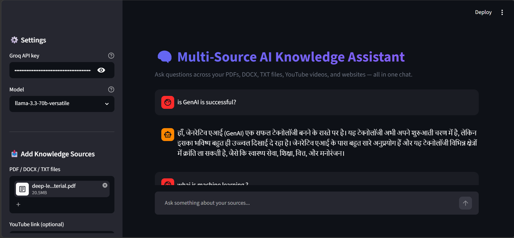
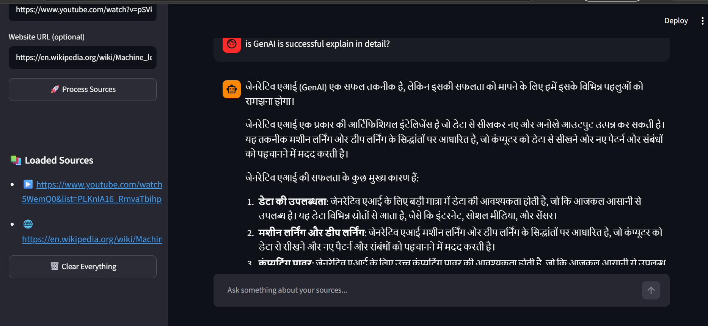
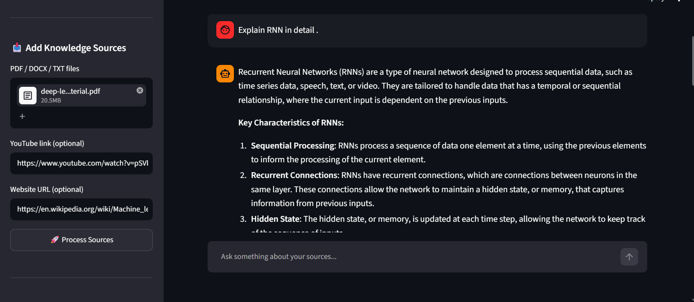

# 🤖 Multi-Source AI Knowledge Assistant

An AI-powered **Retrieval-Augmented Generation (RAG)** application that enables users to ask questions from multiple knowledge sources such as **PDFs, DOCX files, TXT files, Websites, and YouTube videos**. The application retrieves relevant information using vector embeddings and generates accurate, context-aware responses using **Groq LLM**.

---

## 📌 Overview

This project combines modern AI technologies to build a conversational knowledge assistant capable of answering questions from different types of content. It supports document uploads, website scraping, and YouTube transcript extraction, making it a powerful multi-source question-answering system.

---

## ✨ Features

- 📄 Upload and query PDF documents
- 📝 Read DOCX files
- 📃 Read TXT files
- 🌐 Extract content from websites
- 🎥 Fetch YouTube video transcripts
- 💬 Ask natural language questions
- 🧠 Conversational memory for follow-up questions
- ⚡ Fast inference with Groq LLM
- 🔍 Semantic search using Chroma Vector Database
- 🤗 HuggingFace Embeddings
- 🎨 Interactive Streamlit interface

---

## 🛠️ Tech Stack

| Category | Technology |
|----------|------------|
| Programming Language | Python |
| Frontend | Streamlit |
| LLM | Groq (Llama 3.3 70B) |
| Framework | LangChain |
| Embeddings | HuggingFace (all-MiniLM-L6-v2) |
| Vector Database | ChromaDB |
| Website Loader | WebBaseLoader |
| YouTube Loader | youtube-transcript-api |
| Document Parsing | PyPDF, Docx2txt |

---

# 📂 Project Structure

```
Multi-Source-AI-Knowledge-Assistant/
│
├── app.py
├── multi_source_ai_knowledge.py
├── requirements.txt
├── README.md
├── .gitignore
├── .env.example
│
├── screenshots/
│   ├── home.png
│   ├── upload.png
│   └── output.png
│
└── assets/
```

---

# ⚙️ Installation

## 1️⃣ Clone Repository

```bash
git clone https://github.com/ShraddhaPatel1906/Multi-Source-AI-Knowledge-Assistant.git

cd Multi-Source-AI-Knowledge-Assistant
```

---

## 2️⃣ Create Virtual Environment

### Windows

```bash
python -m venv venv
venv\Scripts\activate
```

### Linux / macOS

```bash
python3 -m venv venv
source venv/bin/activate
```

---

## 3️⃣ Install Dependencies

```bash
pip install -r requirements.txt
```

---

## 4️⃣ Create Environment Variable

Create a `.env` file in the project root.

```env
GROQ_API_KEY=YOUR_GROQ_API_KEY
```

---

## 5️⃣ Run the Application

```bash
streamlit run app.py
```

Open:

```
http://localhost:8501
```

---

# 📖 How It Works

```
Documents / Website / YouTube

            │

            ▼

     Data Loading

            │

            ▼

      Text Chunking

            │

            ▼

   HuggingFace Embeddings

            │

            ▼

      Chroma Vector DB

            │

            ▼

      Similarity Search

            │

            ▼

        Groq LLM

            │

            ▼

      AI Generated Answer
```

---

# 📷 Application Screenshots

## 🏠 Home Page

Replace with your screenshot.

```markdown

```

---

## 📂 Upload Documents

Replace with your screenshot.

```markdown

```

---

## 💬 Question Answering

Replace with your screenshot.

```markdown

```

---

# 🚀 Supported Knowledge Sources

| Source | Supported |
|----------|-----------|
| PDF | ✅ |
| DOCX | ✅ |
| TXT | ✅ |
| Website | ✅ |
| YouTube | ✅ |

---

# 📦 Python Libraries Used

- Streamlit
- LangChain
- LangChain Community
- LangChain Groq
- HuggingFace Embeddings
- ChromaDB
- PyPDF
- Docx2txt
- BeautifulSoup4
- youtube-transcript-api
- python-dotenv

---

# 🔮 Future Improvements

- Authentication System
- Chat History Database
- OCR Support
- Image Question Answering
- Audio File Support
- Multi-language Support
- Cloud Deployment
- Citation Highlighting
- File Management Dashboard

---

# 🎯 Learning Outcomes

Through this project I learned:

- Retrieval-Augmented Generation (RAG)
- LangChain Pipelines
- Vector Databases
- Embedding Models
- Prompt Engineering
- Streamlit Application Development
- LLM Integration using Groq
- Website Scraping
- YouTube Transcript Processing
- Conversational AI

---

# 👩‍💻 Author

**Shraddha Patel**

M.Sc. Data Science

Indian Institute of Information Technology, Lucknow (IIIT Lucknow)

GitHub: https://github.com/ShraddhaPatel1906

LinkedIn: *(Add your LinkedIn profile here)*

---

# 📜 License

This project is licensed under the MIT License.

---

# 🙏 Acknowledgements

- LangChain
- Streamlit
- Groq
- HuggingFace
- ChromaDB
- YouTube Transcript API
- BeautifulSoup